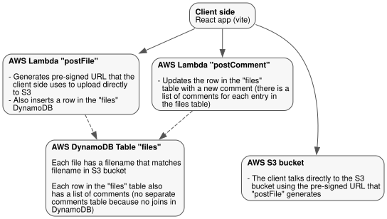

# aws_serverless_photo_gallery

A serverless photo and video gallery built on S3, Lambda and DynamoDB. It
started as an extension of the AWS tutorial
[Uploading to Amazon S3 directly from a web or mobile application](https://aws.amazon.com/blogs/compute/uploading-to-amazon-s3-directly-from-a-web-or-mobile-application/)
and adds

- Commenting on photos
- Uploading both videos and photos
- Upload multiple files at a time
- Some simple sorting and filtering
- Client side image resize for thumbnail
- Client side EXIF parse to read date

## Demo

The example site is https://myloveydove.com/ for our amazing dog dixie (RIP)

Visiting https://myloveydove.com/?password=nottherealpassword shows the
posting/commenting UI, but it will not let you actually post because the
password does not match the server side one (see [Security](#security))

## Architecture

<picture>
  <source
    media="(prefers-color-scheme: dark)"
    srcset="architecture-dark.svg"
  />
  
</picture>

The diagram is generated from `architecture.dot` with `pnpm diagram` (requires
graphviz)

## Development

This is a pnpm workspace containing the `frontend` (React + vite) and the
`lambdas`

```
pnpm install
pnpm dev        # vite dev server against the deployed API
pnpm build      # typecheck and bundle to frontend/dist
pnpm lint
pnpm format
```

The lambdas share a single deployment bundle: every function has
`CodeUri: lambdas/` and selects its entry point with its `Handler`, so the
helpers in `lambdas/lib/` (multipart parsing, the password check, the DynamoDB
client, the JSON response wrapper) exist once rather than once per function.
`sam build` installs their dependencies with npm, independently of pnpm

## Deployment

Install the aws-sam CLI

```
brew install aws/tap/aws-sam-cli
```

Then run

```
sam deploy --guided
```

You can specify the SecretPassword in the guided mode. The deployment

- Creates lambda functions for posting/reading files and comments
- Creates dynamodb tables for guestbook and files
- Creates an s3 bucket that it puts the photos in. It has a coded name like
  `sam-app-s3uploadbucket-1fyrebt7g2tr3`. Public read comes from a bucket policy
  rather than a `public-read` ACL on each object, because S3 disables ACLs on
  new buckets

The tables and the upload bucket are marked `DeletionPolicy: Retain`, so tearing
the stack down does not take the photos with it

Then add an `aws s3 sync` script to `frontend/package.json` pointing at your
website bucket and run it. Note that your website bucket should be different
from the one automatically created by `template.yaml` here

## Security

Only someone who visits the page with a special URL format e.g.
`?password=yourSecretPassword` can upload files and post comments. Having the
password helps prevent drive by spam that would be otherwise hard to moderate

If the password URL parameter is not supplied, the buttons for uploading are
hidden, but if it is supplied they are shown. It still has to match the server
side secret password to succeed posting

## Database design

This code uses a simple DynamoDB database. I considered using Amazon RDS (e.g. a
real database instead of dynamoDB) but the administration was too complicated,
and so instead I updated the DynamoDB to have comments for the files directly
inside the files table. Storing them separately would imply a join which
DynamoDB does not have

Note that there was a nice recommendation on reddit to use specialized keys in
DynamoDB to help avoid these problems, see
[issue #8](https://github.com/cmdcolin/aws_serverless_photo_gallery/issues/8)

## Scalability

The client side currently fetches all photo JSON info and comments for all the
pages of the app in one query. Only the actual img tags on the page download at
a given time though. Unless you have a very large number of photos this is
probably fine. Doing pagination properly would require making a paginated
DynamoDB query but it doesn't use standard LIMIT/OFFSET so it's a little quirky

## Credits

I used a ton of amazing gifs from https://gifcities.org/ and a couple other
places. Thank you to the creators of all those gifs and the internet historians
preserving them. There are many other thanks to give but I'm just grateful to
share :)

If you are interested in using this and need help, particularly if you want to
use it for a memorial page, feel free to contact me
